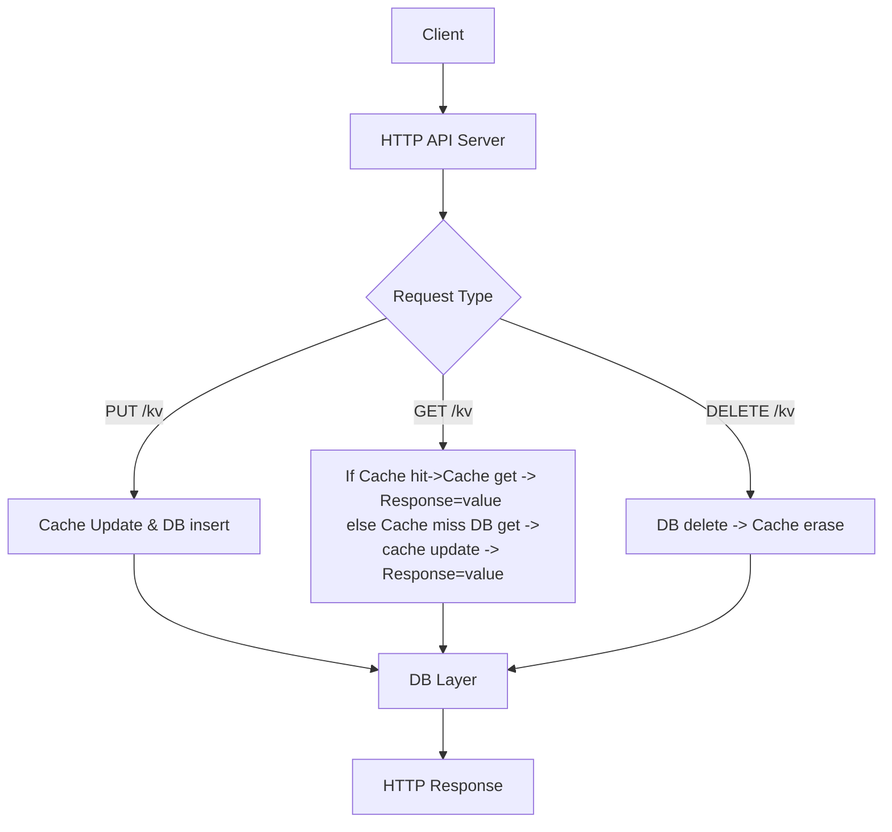

# Key-Value Store (C++)

## 🧩 Project Description

This project implements a lightweight **Key-Value Store** server in **C++**, exposing REST APIs for storing, retrieving, and deleting data.  
It is designed for low latency and high availability using an in-memory **LRU cache** with **PostgreSQL** as persistent storage.

### ⚙️ Core Features
- **RESTful API** using `cpp-httplib`
- **Thread-safe LRU Cache** (O(1) get, put, delete)
- **Persistent Storage** using PostgreSQL (`libpqxx`)
- **Write-through caching** for consistency
- **Metrics endpoint** `/metrics` (total requests, hits, misses, cache size)
- **Graceful error handling & logging**

---

## 🧠 Implementation Overview

1. **HTTP Layer**  
   Uses `cpp-httplib` to handle API routes:
   - `PUT /kv?key=<key>&value=<value>` — Store or update a key-value pair  
   - `GET /kv?key=<key>` — Retrieve a value  
   - `DELETE /kv?key=<key>` — Delete a key  
   - `GET /metrics` — Return server statistics  

2. **Cache Layer**  
   - Implements a thread-safe **LRU cache** using `unordered_map` and `list`.  
   - Acts as a front layer to reduce DB reads.  
   - Maintains cache hit/miss metrics.

3. **Database Layer**  
   - Uses `libpqxx` to connect to **PostgreSQL**.  
   - Stores key-value pairs in table:
     ```sql
     CREATE TABLE kv_store (
       key TEXT PRIMARY KEY,
       value TEXT
     );
     ```

4. **Metrics & Logging**  
   - Tracks total requests, cache hits/misses, and cache size.  
   - Exposed via `/metrics` endpoint.

---

## 🧱 System Architecture (Hierarchical)

